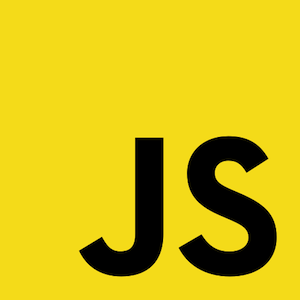
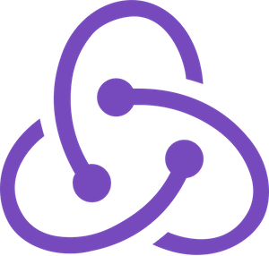
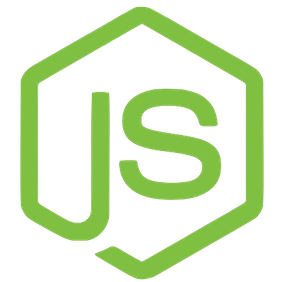

## Hello friend 👋. I'm Gero, a full-stack JavaScript developer

I come from a hospitality background where the lack of technological innovation within the industry led me to make the jump to programming. Ultimately I wanted to build solutions rather than just wish for them, giving me the oppertunity to explore my creative side.

When I'm not coding I love to surf 🏄‍♂️ and read up on the lastest SpaceX news 🚀.

### What I'm Doing

- 🔭 I'm currently working on refactoring [VENT0](https://github.com/geroalexander/vento_client) from React-Native to React (as a PWA) using TypeScript, focusing on state management and CI/CD.
- 🌱 I love using the command line and want to level up my linux sklls. Currently learning bash scripting and going on from there!
- 📫 Drop me a message at **gero.codes@gmail.com**

### My Main Tech Stack

### Socials
- [LinkedIn](https://www.linkedin.com/in/gerokassing)
